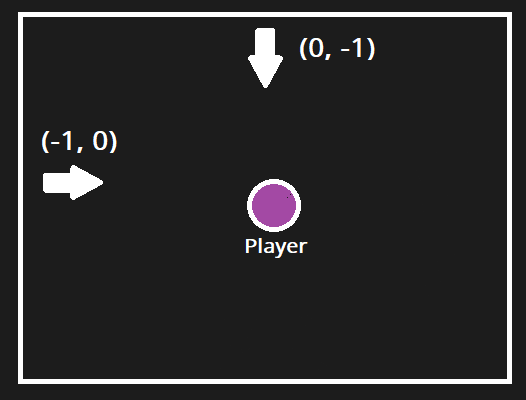
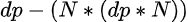
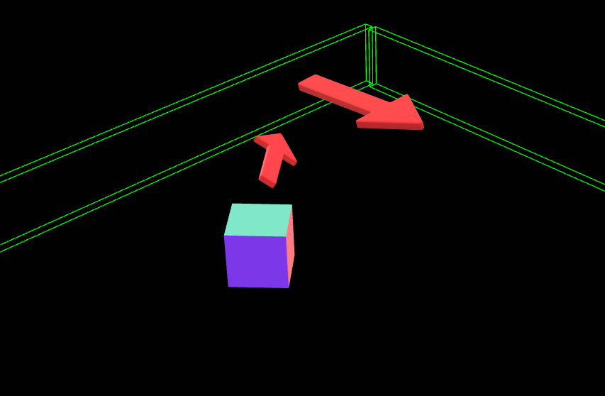

# Three.js - 3D Character wall sliding

## 🤔 What this Repo contains:
- Complex project structure for Threejs - by Bruno Simon [https://github.com/brunosimon]
- Basic character controller movements (WASD) 
- Wall sliding 3D games simulation

## 👨‍💻 Logic of Wall Sliding simulation
Many 2D/3D videogames manage the collision of the character with the walls by making the character slide along the direction of the wall and preventing him from moving forward.

- First, the idea is to obtain wall normals "normalized" to Vector2(0,1) according to the direction they are pointing (For 2d just consider xy axes, for 3d consider axes of movement, without the y axes)



- Next, you need the "deltaPosition" of the character.
Calculate the previousPosition every RequestAnimationFrame (or the ratio you want to use), the formula will be: *dp = previousPosition - currentPosition*

- Once you got the deltaPosition and every wall normalized direction vector (we can call it N), you have to calculate the new deltaPosition following this formula

<p align="center">
    
</p>

- Finally you have to obtain the newX and the newZ by adding the *newDp* to the current character position and change the position of it according to the detected wall

``` javascript
    const newX = this.character.position.x + newDp.y
    const newZ = this.character.position.z + newDp.x

```

## 😎 Live Example
<p align="center">
    
</p>

- Live Version: [wallSliding](https://wall-sliding.vercel.app/)

## ⚙️ Setup
Download [Node.js](https://nodejs.org/en/download/).
Run this followed commands:

``` bash
# Install dependencies (only the first time)
npm install

# Run the local server at localhost:8080
npm run dev

```
